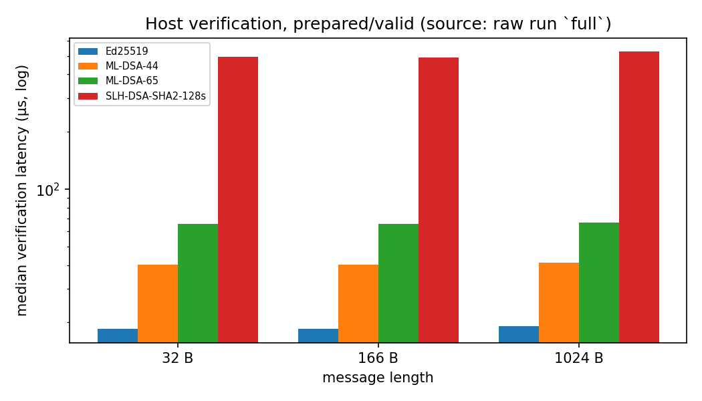

# PQ-Solana Lab

An applied research prototype measuring whether standardized post-quantum
signatures are practical for **application-level authorization on Solana**,
against an Ed25519 baseline. Reuses published cryptographic libraries; the
contribution is the experimental design, integration, adversarial tests, and
analysis.

## Research question

> Under a specified Solana transaction format and execution environment, what
> limits the practicality of standardized post-quantum signatures for
> application authorization: payload size, verification resources, or
> integration constraints?

## The finding, with scope

**Both, at different layers.** A 2,420-byte ML-DSA-44 signature plus the
166-byte intent exceeds the 1,232-byte legacy/v0 transaction budget *even with
the key registered* (measured 2,758 bytes; SLH-DSA-SHA2-128s is worse at 8,194
bytes). Solana's 4,096-byte v1 format admits ML-DSA-44 — 2,762 bytes registered,
or 4,074 bytes inline on a minimal two-account template — but an *operational*
template (a key-registry account, an authorization-state account, and explicit
compute/loaded-data limits) pushes the inline case to 4,148 bytes, 52 bytes over
the limit. Separately, the `fips204` ML-DSA-44 verifier compiles for Solana's
sBPF (with stack-frame diagnostics), **loads and deploys successfully** on a
local validator, and then **aborts at runtime** with an access violation before
any verdict (418 CU) — so verification resources, not just transport, limit it.
A second implementation (RustCrypto `ml-dsa`) behaves the same way. Scope: one
toolchain, one local validator; host timings are never converted into compute
units; no universal infeasibility is claimed.

## Reproduce

```sh
rustup toolchain install 1.91.1   # pinned via rust-toolchain.toml
cargo test --release --locked                                 # 78 tests
cargo run --release --locked -- demo                          # sign/verify + authorization accept/reject
cargo run --release --locked -- transport                     # serialized legacy/v0/v1 + staged model
cargo run --release --locked -- benchmark --config configs/quick.json --run-id quick-r1   # ~2-3 min pilot
cargo run --release --locked -- benchmark --config configs/full.json  --run-id full-r1    # full profile (SLH-DSA dominates)
```

Each run needs a unique `--run-id` (it refuses to overwrite an existing run
unless `--force` is given). Before writing results it records provenance —
revision, dirty-tree patch, source/manifest/lockfile/config hashes, toolchain,
host, and sampling settings — in `results/<run-id>.json`; raw samples go to
`results/raw/<run-id>.csv` and summaries to `results/summaries/<run-id>.csv`.

Python analysis environment (isolated, documented in `scripts/requirements.txt`):

```sh
python3 -m venv .venv && . .venv/bin/activate
pip install -r scripts/requirements.txt
python3 scripts/plot_results.py results/raw/full-r1.csv results/summaries/full-r1.csv results/transport.json results/plots
python3 scripts/report_tables.py generate   # writes results/tables/* and the report tables
python3 scripts/report_tables.py check      # fails if the published tables are stale
```



## Demo

`cargo run --release -- demo` prints, with genuine output: signature adapters
for four schemes (sizes + accept/reject), then a withdrawal authorization that
accepts one request and rejects replay, a tampered amount, an expired request,
and a correctly-signed wrong-network request. `scripts/demo.sh` runs this plus
`transport` (short). The benchmark pilot is a separate step
(`scripts/bench-pilot.sh`).

## Report, design, threat model

- `docs/report.md` — the research report (finding, methodology, generated
  results tables, security argument, limitations).
- `docs/encoding.md`, `docs/threat-model.md`, `docs/methodology.md`,
  `docs/transport.md`, `docs/solana-feasibility.md`, `docs/technical-note.md`,
  `docs/progress.md`, `docs/ai-usage.md`, `docs/demo-outline.md`,
  `docs/interview-qa.md`.
- `idea.md` / `plan.md` — project definition and milestone plan.
- `results/provenance.md` — what produced each artifact, and what is superseded.
- `experiments/outcome/` — sBPF build/loader/execution evidence.

## Design summary

A byte-oriented signature interface (`src/crypto.rs`) dispatches Ed25519,
ML-DSA-44, ML-DSA-65, and SLH-DSA-SHA2-128s behind keygen/sign/verify/strict
verify/key validation/prepared keys. A canonical 166-byte intent
(`src/intent.rs`) and a local authorizer (`src/authorization.rs`) bind requests
to registered keys, environment, expiry, and monotonic nonces; weak Ed25519
keys are rejected and authorization verifies strictly. `src/bench.rs` measures
primitives and complete authorization with documented boundaries, `black_box`
optimization barriers, and post-timing result validation; `src/transport.rs`
serializes real transactions (bincode for legacy/v0, the SDK's `wincode` for v1)
and a staged upload protocol; `src/provenance.rs` captures per-run provenance;
`experiments/sbpf-verifier/` is the bounded on-chain experiment.

## Measurement boundaries

`cargo run --release -- benchmark` reports four distinct boundaries: prepared-key
primitives, the serialized-byte adapter, the strict Ed25519 verification used by
authorization, and complete authorization (registry lookup, decoding, policy,
strict verification, and the atomic nonce/ledger update — with valid state
progression for accepts and a separate replay-rejection workload). See
`docs/methodology.md`.

## Evidence types

- **Measured** — host wall-clock samples and actual transaction wire bytes.
- **Modeled** — the staged-upload lifecycle (each component transaction is
  serialized; the sequence is not executed). A lower-bound estimate.
- **Inferred** — conclusions are scoped to the measured implementation and
  environment; nothing unmeasured is presented as measured.

## Limitations

- Host timings are one implementation on one machine; not constant-time
  evidence, not a ranking, and not convertible to compute units.
- Staged upload is a model; registration, account rent, cleanup, and compute are
  not modeled.
- v1 bytes are produced by the SDK's encoder/decoder only; no validator
  accepted or executed them.
- The sBPF result is a runtime access violation (no verdict) for two library
  builds under one toolchain and one local validator; a heap-allocating verifier
  may differ.
- The oversized sBPF fixture travels through account data; this validator's RPC
  enforces the 1,232-byte packet limit, so no v1 transaction was executed.
- Replay state is in-memory only; production persistence is future work.

## Attribution

| Primitive | Crate (pinned) | Standard | Independent evidence here |
| --- | --- | --- | --- |
| Ed25519 | `ed25519-dalek` 3.0.0 | RFC 8032 | §7.1 known-answer tests |
| ML-DSA-44/65 | `fips204` 0.4.6 | FIPS 204 | ML-DSA-44 interop vs RustCrypto `ml-dsa` 0.1.1 |
| SLH-DSA-SHA2-128s | `fips205` 0.4.1 | FIPS 205 | self round-trip |
| transactions | `solana-sdk` 5.0.0 (bincode, `wincode`) | — | actual serialization + wire decode |

No new cryptography is implemented here. This does not make Solana, a wallet,
or native transaction signing quantum secure, and provides no production
custody. AI assistance is recorded in `docs/ai-usage.md`.
