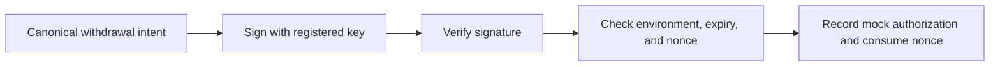

# PQ-Solana Lab

**Working repository name:** `pq-solana-lab`  
**Project type:** Applied cryptography research prototype  
**Primary language:** Rust  
**Initial scope:** Seven days, approximately 40 focused hours  
**Status:** Proposed project; implementation and results are pending

## Overview

PQ-Solana Lab investigates the practical constraints of using standardized post-quantum signatures for application authorization on Solana. It combines a local withdrawal-authorization prototype, reproducible signature benchmarks, transaction-size analysis, and a bounded experiment with verification in Solana's execution environment.

The project will produce evidence about the interaction between cryptographic choices and blockchain constraints. Its contribution is the experimental design, application integration, adversarial tests, and analysis, using existing libraries for the underlying signature algorithms.

## Problem

A successful signature verification on a desktop does not establish that the same signature is practical in a blockchain application. Integration depends on signature and public-key sizes, transaction overhead, verifier resource requirements, application state, and the way keys are registered and trusted.

NIST specifies ML-DSA in [FIPS 204](https://csrc.nist.gov/pubs/fips/204/final) and SLH-DSA in [FIPS 205](https://csrc.nist.gov/pubs/fips/205/final). These standards provide concrete schemes to evaluate against an Ed25519 baseline.

For a withdrawal application, signature validity is only one condition for authorization. The application also needs to establish which key is trusted, what the signature authorizes, whether the request belongs to the correct network and program, and whether it has expired or already been used.

## Research question

> Under a specified Solana transaction format and execution environment, what limits the practicality of standardized post-quantum signatures for application authorization: payload size, verification resources, or integration constraints?

The experiments will address five narrower questions:

1. How do selected signature schemes compare in host key-generation, signing, and verification time, public-key size, and signature size?
2. How much transaction space remains when an authorization request and its signature are included in instruction data?
3. How does registering the public key separately change the transport budget?
4. What does staged signature upload solve, and which verification or state-management problems remain?
5. Can the selected ML-DSA verifier compile and execute correctly under the tested Solana runtime configuration?

## Hypotheses

These are expectations to investigate, not completed findings:

- Payload size may prevent direct inclusion in some transaction formats even when host verification is fast.
- Storing a signature in an account may solve transport constraints while leaving verification-resource constraints unresolved.
- Registered public keys may reduce repeated transport costs, with additional key-registration assumptions.
- Application policy and replay state will reject some requests whose signatures are cryptographically valid.

## Proposed system

### 1. Signature adapters

Implement a small shared Rust interface for key generation, signing, verification, and byte encoding.

| Scheme | Role | Initial priority |
| --- | --- | --- |
| Ed25519 | Classical comparison baseline | Core |
| ML-DSA-44 | Main post-quantum implementation | Core |
| ML-DSA-65 | Additional ML-DSA security category | Extension |
| SLH-DSA-SHA2-128s | Hash-based comparison | Extension |

Start with [`ed25519-dalek`](https://docs.rs/ed25519-dalek/), [`fips204`](https://docs.rs/fips204/), and, if time permits, [`fips205`](https://docs.rs/fips205/). Pin the tested dependency versions and record signing modes and contexts. Label security categories explicitly rather than treating all configurations as equivalent.

### 2. Local withdrawal authorization

Define a canonical withdrawal intent containing:

- Domain prefix and encoding version.
- Signature scheme and registered-key identifier.
- Network/genesis and program identifiers.
- Asset, recipient, and integer amount in base units.
- Monotonic nonce and expiry slot.

Sign the canonical bytes. Verification uses a trusted key registry and checks the application environment, expiry, and expected nonce. A successful authorization consumes its nonce atomically within the local process.

The demonstration uses mock assets and an in-memory ledger. Replay protection is scoped to the lifetime of that state; persistence across restarts is future work.

Tests cover modified request fields, unrelated or unregistered keys, wrong network/program/domain, expiry boundaries, replay, malformed inputs, and unchanged state after rejection. Tests distinguish signature integrity from application policy.

### 3. Benchmark harness

Measure primitives separately from complete application authorization. Prepare verification inputs outside the timer and run optimized builds with documented warm-up and sampling policies.

Publish raw samples, actual sample counts, environment metadata, and summaries. Include median and interquartile range, with percentiles only when supported by enough observations. Slow schemes may use smaller, explicitly reported samples.

Host timings describe the selected implementation and machine. They do not establish constant-time behavior or predict Solana compute-unit consumption.

### 4. Solana transport analyzer

Serialize actual legacy/v0 example transactions carrying authorization material in instruction data. Include ordinary transaction overhead and compare registered versus transported public keys.

Evaluate direct inclusion and staged upload to a data account. Include initialization, chunk uploads, final reference, and any separately reported cleanup costs. An inline public key must still match a trusted registration or key commitment.

Investigate v1 support in the selected SDK. Where serialization is unavailable, publish a clearly labeled model from the documented layout. Every output identifies the transaction format, SDK/runtime version, assumptions, and evidence type: serialized, modeled, or executed. [Solana transaction formats](https://solana.com/docs/core/transactions/versioned-transactions).

### 5. Verifier feasibility experiment

Time-box an ML-DSA-44 verification experiment to four hours. First confirm a minimal Solana program runs, then attempt verification-only code with a genuine host-validated fixture.

The outcome is either correct executed verdicts with resource measurements or a reproducible compilation/runtime blocker. Save the exact versions, configuration, command, and logs. Conclude only what the tested implementation and environment establish. [Solana program execution and limits](https://solana.com/docs/core/programs).

## Security model

The prototype assumes a trusted key registry, correctly configured application identifiers, trustworthy expiry input, secure key generation, and correct signature-library behavior. The adversary may alter or replay requests, submit malformed bytes, and supply signatures from other keys.

The report will explain a conditional application argument: accepting a new unauthorized canonical intent under a trusted registered key would require a signature forgery, assuming secure signatures and unambiguous encoding. Replay prevention is a separate property enforced by nonce state.

Tests provide behavioral evidence. They do not prove the underlying signature scheme or establish production security.

The system studies application-level authorization. Native Solana transaction signing, fee payment, key registration, and any administrative authority retain their own security assumptions. The prototype does not establish end-to-end quantum security for Solana or a wallet.

## Intended contribution

The project aims to provide:

- A reproducible comparison connecting standard signature implementations to a concrete blockchain workload.
- An authorization prototype with explicit trust, encoding, and state assumptions.
- A transaction transport analysis that distinguishes measured serialization from estimates.
- A documented verifier feasibility result, including blockers when encountered.
- A short research report connecting observations to security reasoning and practical design choices.

Novelty will be assessed through related-work review. No new signature construction or performance improvement is claimed in advance.

## Deliverables and success criteria

The initial release should contain a runnable Rust demo, correctness and adversarial tests, benchmark configuration and raw results, environment metadata, three plots, transport outputs, verifier experiment notes, and a four-to-six-page research report.

A successful release lets another developer:

1. Accept a legitimate mock request and observe rejection of tampering, replay, and policy violations.
2. Reproduce a small benchmark and transaction-size analysis.
3. Trace reported values back to configurations and raw evidence.
4. Identify which conclusions are measured, modeled, or unresolved.
5. Distinguish original project work from reused libraries and cited research.

The on-chain experiment is complete when it yields either genuine execution evidence or an exact reproducible blocker. A production deployment is not a condition for this research prototype's success.

## Future research

Possible follow-up work includes persistent replay state, additional implementations and hardware, stronger interoperability checks, runtime-specific verifier optimization, and threshold ML-DSA.

For threshold signing, [Efficient Threshold ML-DSA](https://eprint.iacr.org/2026/013) is a starting point for studying security models and rejection sampling. Implementing that protocol requires a separate scope. Independent multisignature approvals do not demonstrate MPC threshold signing.

Proof-based verification aggregation is another future direction. Any such extension must state the proof system's assumptions; wrapping post-quantum signatures in a proof does not automatically make the complete construction post-quantum secure.

## Execution plan

The companion [seven-day milestone plan](plan.md) defines tasks, completion gates, time limits, and fallback options. The first working slice is an ML-DSA-44 signature that verifies after serialization, with altered-message and wrong-key rejection tests.
